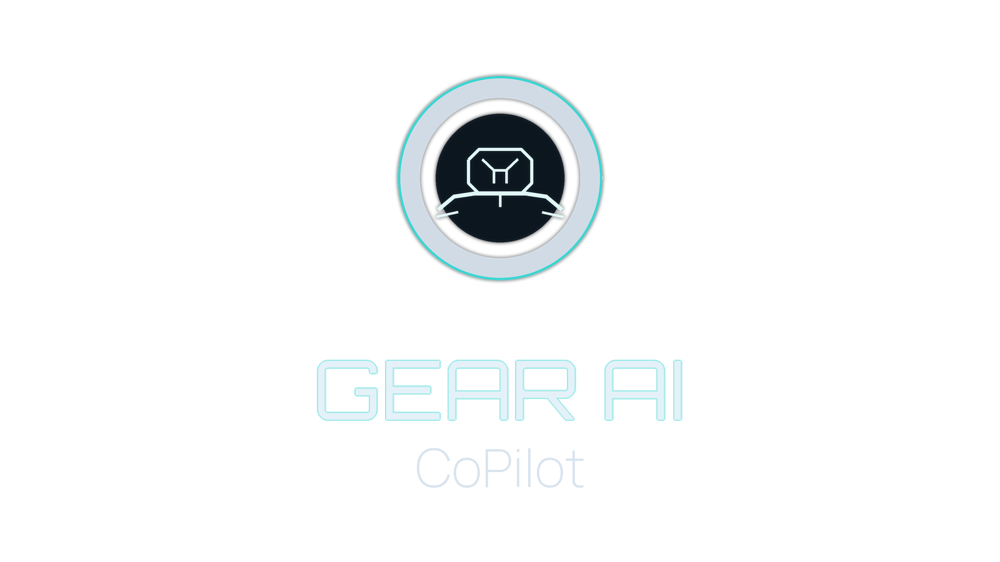

# Gear AI CoPilot 🚗🤖

> Your intelligent automotive ownership assistant - powered by AI, telematics, and real-time market data.

**Gear AI CoPilot** is a comprehensive mobile application that consolidates fragmented automotive tools into a single, intelligent "Digital Twin" for your vehicle. From VIN decoding and owner's manual RAG chat to OBD-II diagnostics and real-time valuation, Gear AI transforms how you manage, maintain, and understand your vehicle.

[](LICENSE)
[](https://reactnative.dev/)
[](https://expo.dev/)
[](https://www.typescriptlang.org/)
[](https://supabase.com/)



---

## 🎯 Development Stage: Phase 1 MVP (85% Complete)

**Current Status**: Late Phase 1 development with production-ready infrastructure, UI, and core backend services implemented.

📊 **[View Development Status](docs/DEVELOPMENT_STATUS.md)** | **[Comprehensive Assessment](docs/APP_DEVELOPMENT_STAGE_ASSESSMENT.md)**

**Key Highlights**:
- ✅ Infrastructure: 95% complete (deployment-ready)
- ✅ Frontend UI: 95% complete (all screens designed)
- ✅ Backend: 70% complete (core CRUD services implemented)
- ⏱️ Time to MVP: 1-2 weeks (testing & polish)

---

## 📋 Table of Contents

- [Development Stage](#-development-stage-phase-1-mvp-65-complete)
- [Features](#-features)
- [Brand System](#-brand-system)
- [Technology Stack](#-technology-stack)
- [Getting Started](#-getting-started)
- [Project Structure](#-project-structure)
- [Documentation](#-documentation)
- [Subscription Tiers](#-subscription-tiers)
- [Roadmap](#-roadmap)
- [Contributing](#-contributing)
- [License](#-license)

---

## 🎨 Brand System

Gear AI CoPilot uses a canonical asset set in `assets/branding` for all runtime branding:

- `gearai-full.png`: primary lockup for hero/login/brand header surfaces
- `gearai-wordmark.png`: standalone wordmark for compact headings
- `gearai-icon.png` / `gearai-icon-micro.png`: symbol variants for nav and small UI contexts
- `gearai-button-symbol.png`: high-value action glyph (send, save, AI actions)

Platform metadata assets are generated from the canonical set:

- `assets/images/icon.png`
- `assets/images/adaptive-icon.png`
- `assets/images/splash-icon.png`
- `assets/images/favicon.png`

Raw design exports are preserved in `assets/branding/source`.

Trademark usage follows a selective approach: use `™` on hero/legal/lockup surfaces, not on tiny utility labels.

---

## ✨ Features

**Note**: UI components are complete for all features below, but backend integration is partial. See [Development Assessment](docs/APP_DEVELOPMENT_STAGE_ASSESSMENT.md) for details.

### Current (Phase 1 - MVP)

- ✅ **Liquid Glass UI**: Premium glassmorphism design system (100% complete)
- ✅ **VIN Decoding**: NHTSA API integration for vehicle identification (100% complete)
- ✅ **Vehicle Management**: Add, edit, delete vehicles with VIN entry (100% complete)
- ✅ **Maintenance Tracking**: Log service history with cost tracking (100% complete)
- ✅ **Storage Service**: Photo uploads for vehicles and receipts (100% complete)
- ✅ **Chat Persistence**: Save chat sessions and conversation history (100% complete)
- ✅ **Authentication**: Firebase Auth with Supabase sync (100% complete)
- ✅ **Subscription Management**: Tier limits and feature access control (100% complete)
- ⚠️ **Owner's Manuals**: Browse and access vehicle manuals (UI complete, content pending)
- ⚠️ **AI Chat Assistant**: Conversational AI for automotive questions (UI complete, needs integration)
- ⚠️ **Multi-Vehicle Support**: Manage multiple vehicles (backend ready, UI integration pending)
- ⚠️ **Diagnostic Dashboard**: View diagnostic trouble codes (UI complete, OBD-II pending)

### Coming Soon (Phase 2-3)

- 🔜 **RAG-Powered Manual Chat**: Ask specific questions, get manual-backed answers
- 🔜 **OBD-II Diagnostics**: Real-time vehicle health via Bluetooth ELM327 adapter
- 🔜 **Visual Damage Detection**: AI-powered damage assessment from photos
- 🔜 **Real-Time Valuation**: Market value tracking with depreciation analysis
- 🔜 **Loan & Lease Tracker**: Financial optimization tools

### Future (Phase 4+)

- 🚀 **Marketplace Integration**: Sell directly to AutoTrader, CarGurus
- 🚀 **Predictive Maintenance**: ML-based failure prediction
- 🚀 **Fleet Management**: Business dashboard for dealers and fleets

See [ROADMAP.md](docs/ROADMAP.md) for detailed phase planning.

---

## 🛠️ Technology Stack

### Frontend
- **Framework**: React Native 0.79 with Expo SDK 53
- **Language**: TypeScript 5.8
- **Navigation**: Expo Router (file-based routing)
- **UI Components**: Custom "Liquid Glass" design system
- **Styling**: Expo Linear Gradient, Expo Blur

### Backend
- **BaaS**: Supabase (PostgreSQL 15 + pgvector)
- **Auth**: Firebase Auth (synced with Supabase)
- **Serverless**: Supabase Edge Functions (Deno runtime)
- **Storage**: Supabase Storage (for photos, manuals)

### AI/ML
- **LLM**: OpenAI GPT-4 for conversational AI
- **Embeddings**: intfloat/e5-base-v2 (768 dimensions)
- **Vector Search**: pgvector with ivfflat indexing
- **Computer Vision**: YOLOv8 (planned for damage detection)

### Third-Party APIs
- **VIN Decoding**: NHTSA vPIC
- **Diagnostics**: CarMD
- **Valuation**: MarketCheck, Black Book
- **Parts**: SEMA Data (ACES/PIES)
- **Payments**: Stripe Connect

---

## 🚀 Getting Started

> **Important**: Complete setup guide available! See [SETUP_GUIDE.md](SETUP_GUIDE.md) for detailed instructions.

### Quick Start

1. **Clone and Install**
   ```bash
   git clone https://github.com/mmanthe37/gear_ai_v2.git
   cd gear_ai_v2
   npm install
   ```

2. **Configure Environment**
   ```bash
   cp .env.example .env.local
   # Edit .env.local with your Firebase and Supabase credentials
   ```

3. **Validate Setup**
   ```bash
   npm run setup
   ```

4. **Start Development**
   ```bash
   npm start
   # Press 'w' for web, 'i' for iOS, 'a' for Android
   ```

### Full Setup Guide

For complete installation, configuration, and deployment instructions, see:
- 📖 **[Setup Guide](SETUP_GUIDE.md)** - Step-by-step setup instructions
- 🚀 **[Deployment Ready Guide](DEPLOYMENT_READY.md)** - Prepare for production deployment
- 🏗️ **[Build & Deployment](docs/BUILD_DEPLOYMENT.md)** - Comprehensive deployment options

---

## 📊 Current Status

This repository has been cleaned and refactored:
- ✅ Removed 250+ lines of dead code
- ✅ Consolidated documentation (16 → 10 files)
- ✅ Eliminated redundant dependencies
- ✅ Ready for environment configuration

See [docs/DEVELOPMENT_STATUS.md](docs/DEVELOPMENT_STATUS.md) for feature completion status.

---

## 📁 Project Structure

```
gear_ai_v1/
├── app/                    # Expo Router screens
│   ├── (tabs)/            # Tab navigation screens
│   ├── chat/              # Chat conversation screens
│   ├── _layout.tsx        # Root layout
│   ├── index.tsx          # Landing/home
│   └── login.tsx          # Authentication
├── components/            # Reusable UI components (9 components)
├── contexts/              # React contexts (Auth)
├── lib/                   # Third-party integrations
│   ├── firebase.ts        # Firebase setup
│   └── supabase.ts        # Supabase client
├── services/              # Business logic (9 services)
│   ├── ai-service.ts      # OpenAI integration
│   ├── auth-service.ts    # Authentication
│   ├── diagnostic-service.ts
│   ├── manual-*.ts        # Owner's manual services
│   ├── rag-pipeline.ts    # Vector search
│   └── vin-decoder.ts     # NHTSA VIN API
├── types/                 # TypeScript definitions (8 type files)
├── docs/                  # Documentation (10 docs)
├── supabase/             # Database migrations
└── assets/               # Images, fonts, icons
```
---

## 📚 Documentation

Comprehensive documentation is organized in the `/docs` directory:

### Essential Guides
- 🚀 **[Deployment Ready](DEPLOYMENT_READY.md)** - Prepare for production deployment
- 📊 **[Development Status](docs/DEVELOPMENT_STATUS.md)** - Current completion status
- 🏗️ **[Architecture](docs/ARCHITECTURE.md)** - System design and technology stack
- 📖 **[Quick Start](docs/QUICK_START.md)** - Getting started guide

### Technical Documentation
- 🗄️ **[Database Schema](docs/DATABASE_SCHEMA.md)** - Supabase database design
- 🔌 **[API Integration](docs/API_INTEGRATION.md)** - Third-party API specifications
- 🎨 **[Design System](docs/DESIGN_SYSTEM.md)** - "Liquid Glass" UI guidelines
- 🔒 **[Security](docs/SECURITY.md)** - Security & compliance (GDPR, CCPA)
- 🛣️ **[Roadmap](docs/ROADMAP.md)** - Development phases and timeline

### Deployment & Build
- 🏗️ **[Build & Deployment](docs/BUILD_DEPLOYMENT.md)** - Comprehensive deployment guide
- 🔐 **[Authentication](docs/AUTHENTICATION.md)** - Firebase Auth setup

---

---

## 💰 Subscription Tiers

| Feature | Free | Pro ($9.99/mo) | Mechanic ($19.99/mo) | Dealer ($99.99/mo) |
|---------|------|----------------|---------------------|-------------------|
| Vehicles | 1 | 3 | Unlimited | Unlimited |
| VIN Entry | ✅ | ✅ | ✅ | ✅ |
| OCR VIN Scan | ❌ | ✅ | ✅ | ✅ |
| Manual Access | ✅ | ✅ | ✅ | ✅ |
| Basic AI Chat | ✅ | ✅ | ✅ | ✅ |
| RAG Manual Chat | ❌ | ✅ | ✅ | ✅ |
| OBD-II Diagnostics | ❌ | ❌ | ✅ | ✅ |
| Damage Detection | ❌ | ❌ | ✅ | ✅ |
| Valuation Tracking | ❌ | ✅ | ✅ | ✅ |
| Marketplace Tools | ❌ | ❌ | ✅ | ✅ |
| Web Dashboard | ❌ | ❌ | ❌ | ✅ |
| API Access | ❌ | ❌ | ❌ | ✅ |

---

## 🗺️ Roadmap

- **Q1 2025**: MVP Launch (Phase 1) - Auth, Vehicle Management, Basic AI Chat
- **Q2 2025**: RAG & Diagnostics (Phase 2) - Manual RAG, OBD-II integration
- **Q3 2025**: Visual Intelligence (Phase 3) - Damage detection, Valuation API
- **Q4 2025**: Marketplace (Phase 4) - Peer-to-peer sales, Shop network
- **Q1 2026**: Fleet Management (Phase 5) - Business dashboard, API access
- **2026+**: Predictive ML, Global expansion, AR features

See [ROADMAP.md](docs/ROADMAP.md) for detailed feature planning.

---

## 🤝 Contributing

Contributions are welcome! Please read our contributing guidelines before submitting PRs.

1. Fork the repository
2. Create a feature branch (`git checkout -b feature/amazing-feature`)
3. Commit your changes (`git commit -m 'Add amazing feature'`)
4. Push to the branch (`git push origin feature/amazing-feature`)
5. Open a Pull Request

### Code Standards

- Use TypeScript strict mode
- Follow the existing code style (Prettier + ESLint)
- Write descriptive commit messages (Conventional Commits)
- Add tests for new features (when applicable)

---

## 📄 License

This project is licensed under the MIT License - see the [LICENSE](LICENSE) file for details.

---

## 🙏 Acknowledgments

- **NHTSA** - Free VIN decoding API
- **Supabase** - Backend infrastructure
- **OpenAI** - GPT-4 and embeddings
- **Expo** - React Native development platform
- Inspired by modern automotive digital dashboards and AI-first design

---

## 📞 Contact

- **Project Maintainer**: [@mmanthe37](https://github.com/mmanthe37)
- **Email**: support@gearai.app (planned)
- **Issues**: [GitHub Issues](https://github.com/mmanthe37/gear_ai_v1/issues)

---

**Built with ❤️ for automotive enthusiasts and everyday drivers alike.**
